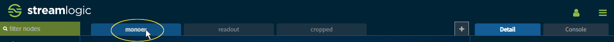
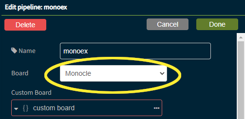
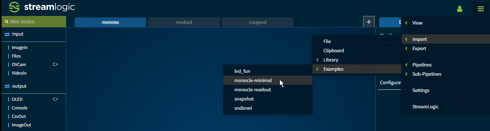
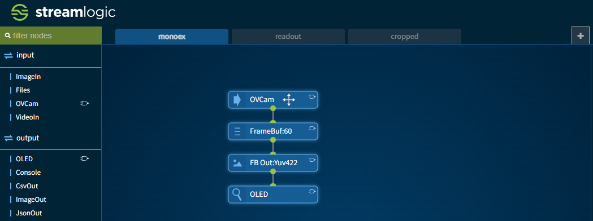
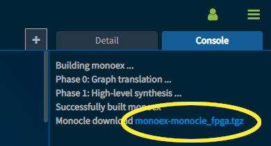
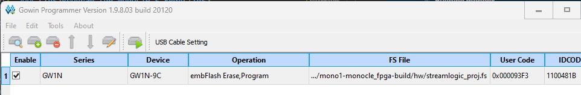

# StreamLogic+MicroPython for Monocle

This document describes how to use StreamLogic FPGA design for the Monocle together with MicroPython firmware.

Many functions of the Moncole are controlled by the FPGA, and the FPGA exposes an API to the Moncole's microcontroller, so that you can control them from software.  The following section describe the process for using StreamLogic and the corresponding MicroPython firmware.

## Software requirements

You will need to install a couple of tools to build the FPGA bitmap and FPGA programming.

1. For FPGA build and programming, install the [Gowin EDA Standard Edition](https://www.gowinsemi.com/en/support/download_eda/) software (_not the educational_).  You will have to register and request a free license to use the Standard Edition which is required for the specific FPGA Monocle uses.

1. Install the StreamLogic command-line helper utilities (optional, requires Python3): `pip install sxlogic`

## Hardware requirements

The Monocle team is working on the ability program the FPGA via Bluetooth.  Until then, a [Gowin programming cable](https://www.gowinsemi.com/en/support/devkits_detail/3/) is required to program the FPGA.  If you have the devkit, the programmer cable will plug right onto the board.  If you have an assembled Monocle, it must be partially disassembled, and could be difficult to program this way.

## StreamLogic FPGA design walkthrough

In this section, we'll walk through the steps to build and program the Monocle with a sample design.

### <ins>Build example FPGA design</ins>

StreamLogic uses Amazon single sign-on, so if you do not already have an account you will need to create one.

Log in to the StreamLogic for Moncole environment:
https://fpga.streamlogic.io/monocle/

Once the darkblue-themed workspace opens, **double click** the page tab as shown here:


That will bring up the properties dialog where you can change the name and **ensure that the selected board is Monocle**, as shown here:



Click **Done** to close the properties dialog.

Add the "monocle-minimal" example to the workspace by clicking on the "hamburger" menu (stacked bars), in the top-right corner, and following the sub-menus as shown here:


When you click moncole-minimal, the import code is attached to your cursor and you can click to place the code anywhere in the workspace.


To build the example design, click the **Build** button at the bottom of the workspace.  You will see progress messages in the console pane, and when it completes, click the download file as shown here:


### <ins>Program the Monocle's FPGA</ins>

The StreamLogic command-line helper takes care of build the FPGA bitmap (binary file required to program the FPGA) from the file you just downloaded from the StreamLogic development environment.  Use the following command to build the bitmap:
```
$ python -m sxlogic.monocle build <download filename>
```

It should produce output something like this:
```
Extracting into mono1-monocle_fpga-build ...
Building bitstream ...
SUCCESS! (log in mono1-monocle_fpga-build\hw\build.log)
BUILT mono1-monocle_fpga-build\hw\streamlogic_proj.fs
```

That `.fs` file is the FPGA bitmap.

To program the FPGA, the Monocle must be awake, so take it off the charger and tap to wake it up.  Next run the Gowin Programmer, and follow these steps:
1. Use the Edit->Add Device menu if the GW1N device is not listed.
1. Double-click the Operation column of the device row, and select Embedded Flash Mode, for the Access Mode, and embFlash Erase, Program for the Operation.  Click the ... button to select the `.fs` file we just produced, and click Save.

It should now look something like this:


Click the green play-like button to program the FPGA, and your done!

## Updating the Monocle's firmware

The pre-installed firmware on the Monocle will not work with the FPGA programs produced by StreamLogic because FPGA <-> MicroController API is not the same.  Follow these instructions to update the Monocle's firmware.

1. Make sure your Monocle is well charged before starting an update.

1. Download both the Brilliant App as well as the nRF Connect App.
    - Get the **Brilliant App** on Apple [AppStore](https://apps.apple.com/us/app/monocle-by-brilliant/id1632203938) or Google [Play Store](https://play.google.com/store/apps/details?id=com.brilliantmonocle).
    - Get the **nRF Connect App** on Apple [AppStore](https://apps.apple.com/us/app/nrf-connect-for-mobile/id1054362403) or Google [Play Store](https://play.google.com/store/apps/details?id=no.nordicsemi.android.mcp&hl=en&gl=US).

1. Download the firmware the streamlogic-monocle-micropython [releases page](https://github.com/sathibault/streamlogic-monocle-micropython/releases), and save it to your mobile.

1. Connect to the Monocle from within the Brilliant App, and type the commands:

    ```python
    import update
    update.micropython()
    ```

1. Switch to the nRF Connect App, and connect to **"DFUTarg"**.

1. Switch to the DFU tab, select your file, and start the update.

1. Keep Monocle close, and don't switch app while the update is in progress.

Once the update is complete, Monocle will restart, and will be running the new firmware.

If the update process stops for any reason, simply put Monocle back into the case, search for **"DFUTarg"** from within the nRF Connect App, and try again.
